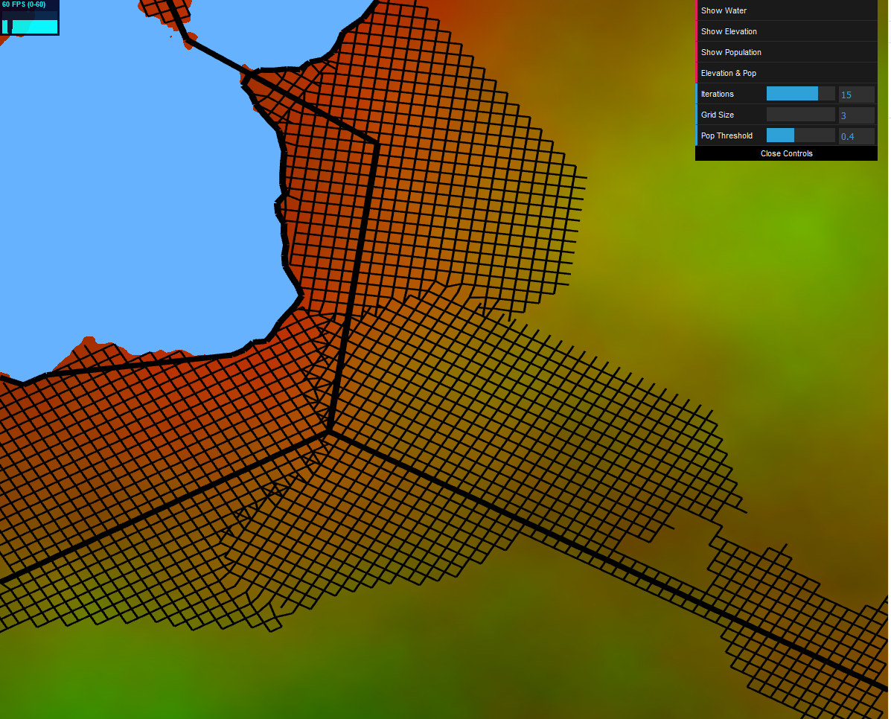
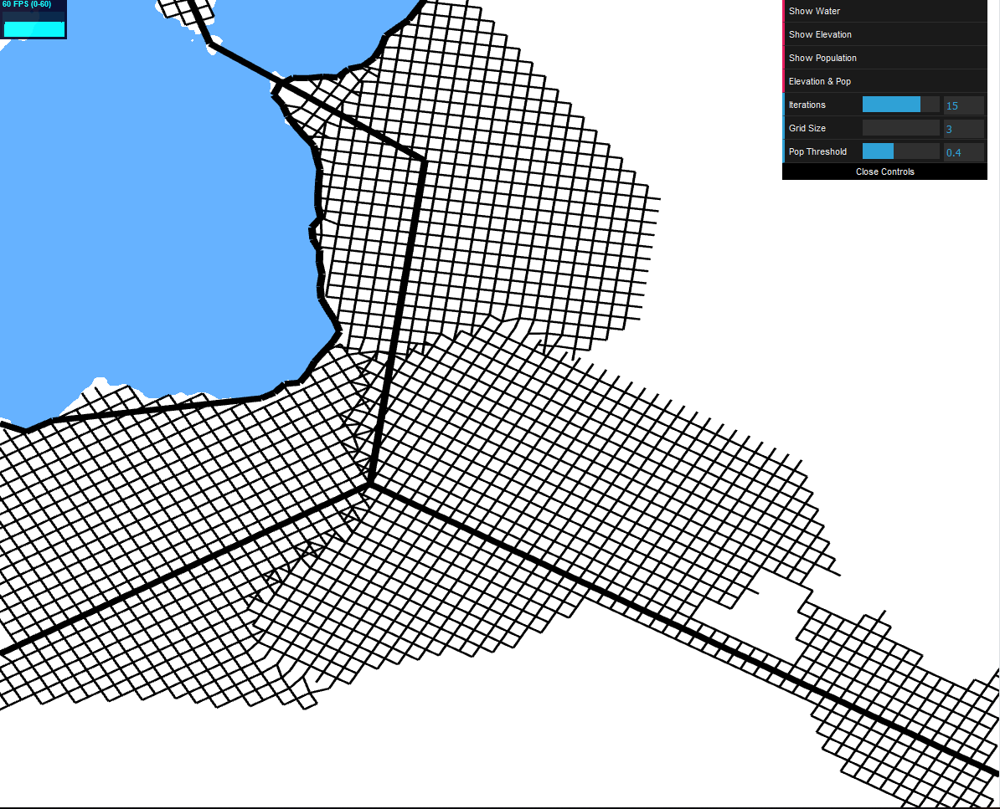
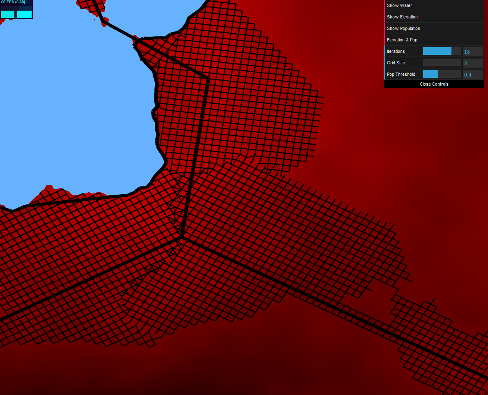
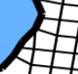
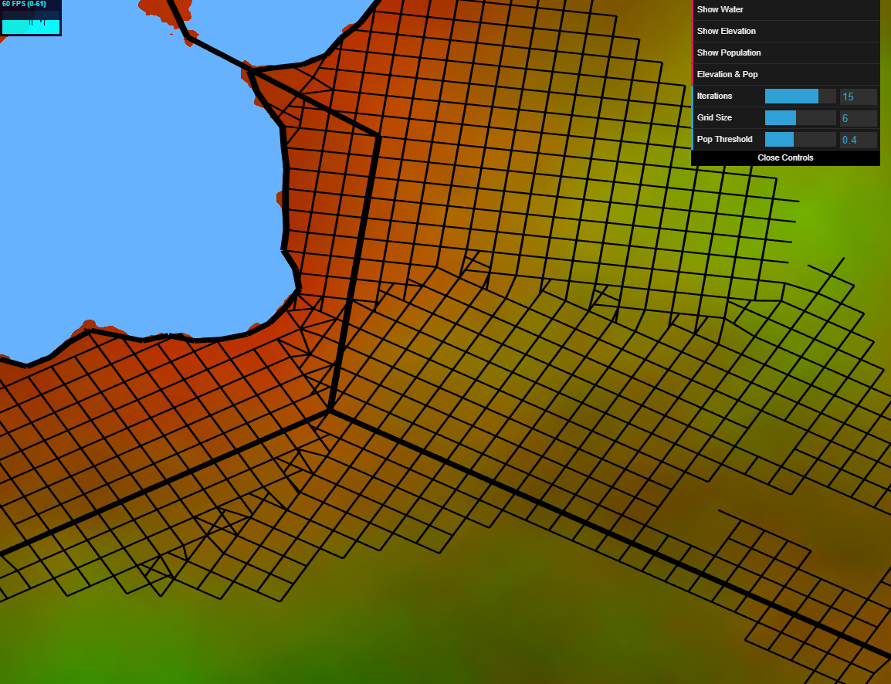
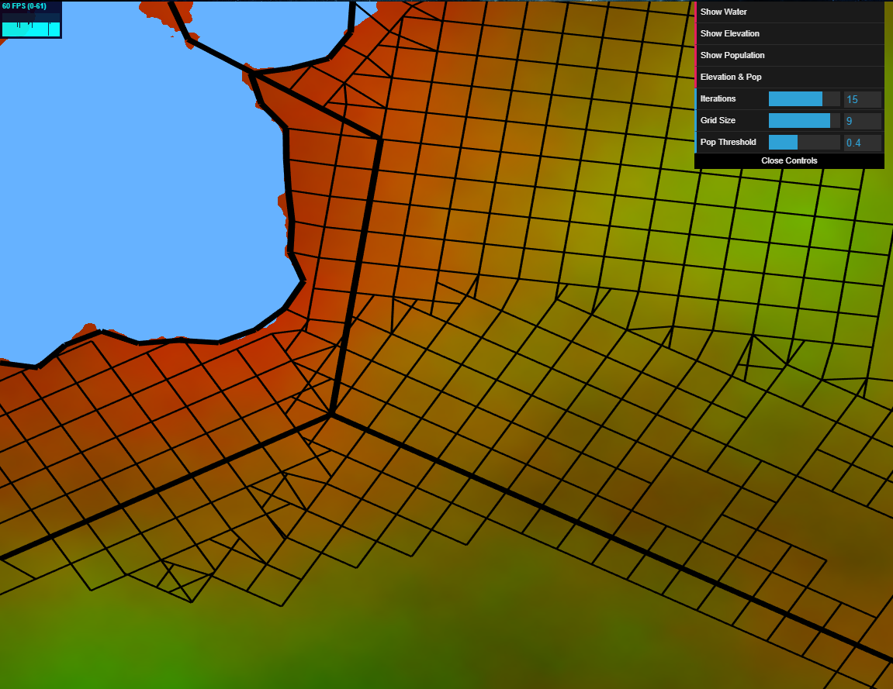
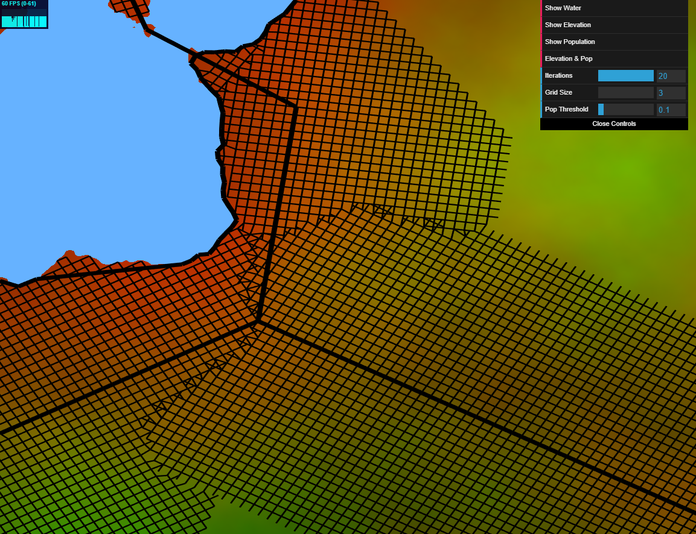
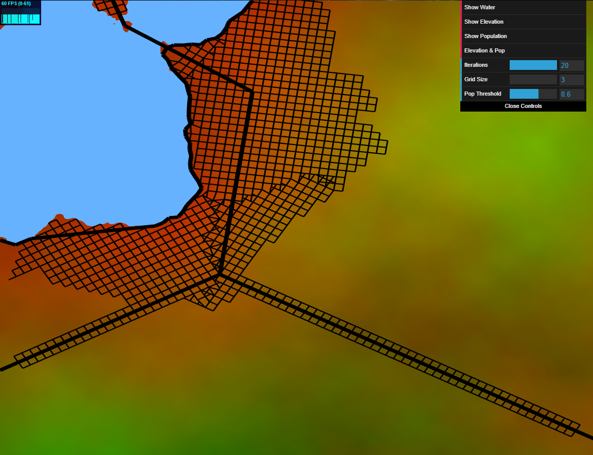

# Homework 5: Road Generation

Jason Wang (jasonwa)

External Resources:
- [Procedural Modeling of Cities](proceduralCityGeneration.pdf) paper implementation 
- Line segment intersection check supporting parallel lines, from https://stackoverflow.com/questions/563198/how-do-you-detect-where-two-line-segments-intersect

Demo (make your window have a 1:1 aspect ratio for best results) : https://jwang5675.github.io/hw05-road-generation/

## Implemented Details

- Generating 2D Map Data
  - I used a 2D FBM Noise function with quadradtic smoothing to generate the water, elevation, and population height fields. Water and elevation is made from the same FBM function, while population density offsets the FBM in order to make the maps different from each other. By sampling different parts of the FBM function, the lower elevation portions of the elevation map has higher popualtion density near the water and the higher elevation portions of the map has lower population density.
  - To recover the noise data from the GPU to the CPU, I added an additional render pass that creates a framebuffer that renders the fbm noise to a texture. The texture stores the FBM information in RGBA texture in the format (r = waterFBM, g = elevationFBM, b = populationFBM, alpha = 1). I then use gl.readPixels() to recover the the pixel data into array format and then query x, y points in the array at index = textureHeight * y * 4 + x * 4 + offset to get fbm information (offsert = 0 implies waterFBM, = 1 implies elevationFbm, etc.)
  -  The user can toggle the gui to show the following map data:
    - Water Map (blue = water, white = land)
    
    - Elevation Map (dark green = low elevation, light green = high elevation)
    
    - Population Map (dark red = low population density, light red = high/dense population density)
    
    - Elevation & Pop Map (elevation and population map layered on each other)
    

- Class Set to Represent LSystems

- Drawing Road Rules
  - Supports:
    - Basic Road Branching: the roads cutoff and do not expand after some specified population threshold defined by the user in the GUI (see below)
    - Checkered Road Branching: the roads all branch off of the highways' forward, up, and right vectors at 90 degrees with a specified maximum width and length based on the grid size defined by the user in the GUI (see below)

- 2D Street Layout
  - Highways are generate and are sparse throughout the scene
  - As the highways are being built, the spawn smaller and thinner road networks with specified denseness based on the user input grid size and population density threshold
  - The smaller roads follow checkered 90 degree and population thrshold cuttoff branching
  - The only roads that can cross water are the thicker highways
  - Roads are self sensitive as described in 3.3.1.
    - Roads implement line segment intersection for interseciton/extension, example: 
    - Roads implement snapping to a nearby point, example 

- Interactive GUI:
  - Changing # of iterations the LSystem Completes (Highways are always completed)
    - 1 Iteration
    
    - 2 Iterations
    
    - 5 Iterations
    
    - 10 Iterations
    
    - 15 Iterations
    
  - Changing Grid Size (Highways are always completed)
    - Grid size = 3
    
    - Grid size = 6
    
    - Grid size = 9
    
  - Population Threshold (Highways are always completed)
    - low threshold to generate a new road
    
    - medium threshold to generate a new road
    
    - high treshold to generate a new road
    
